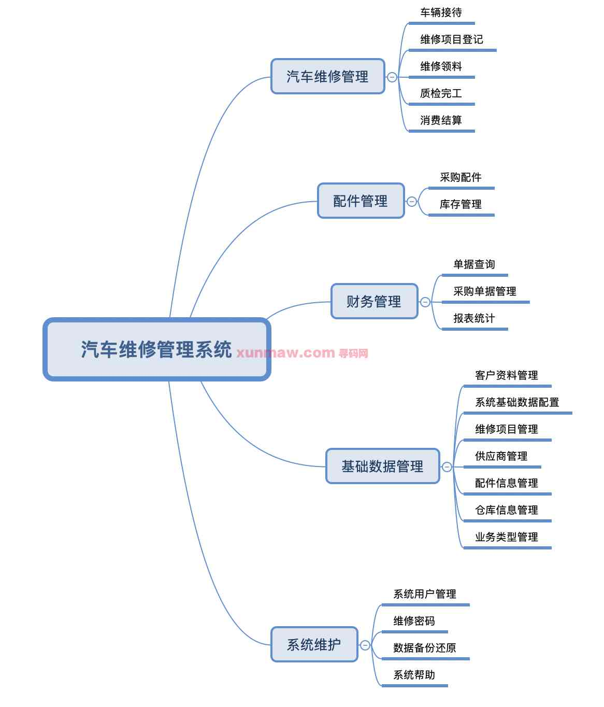
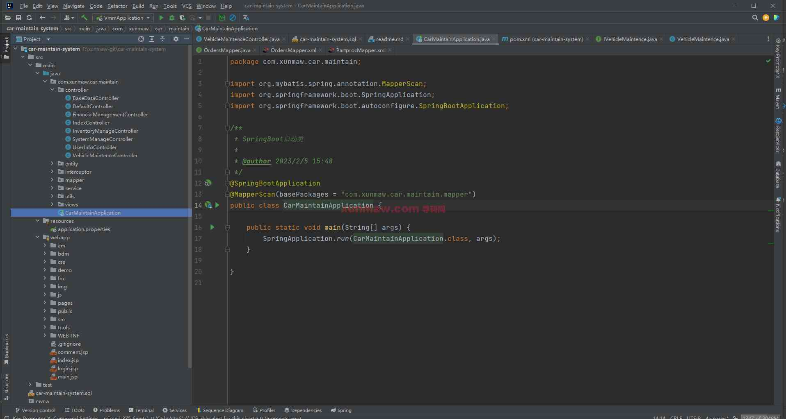
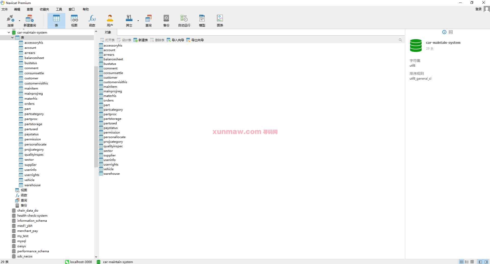
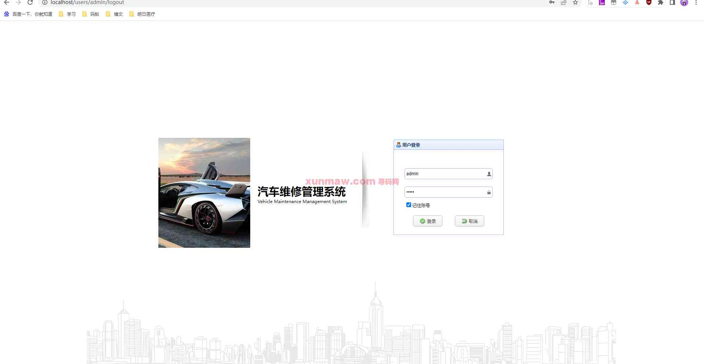
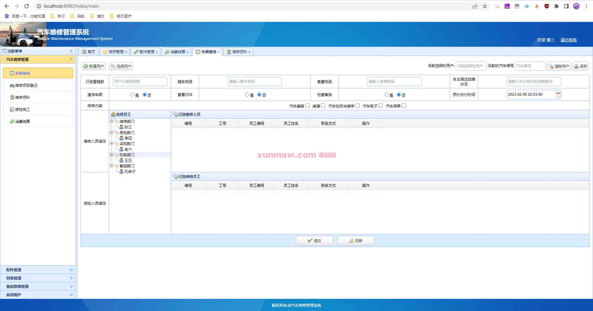
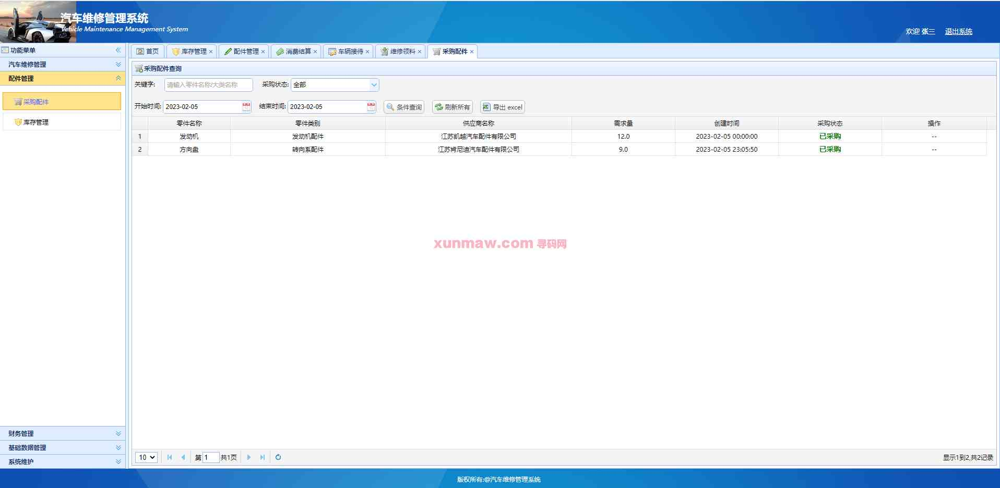
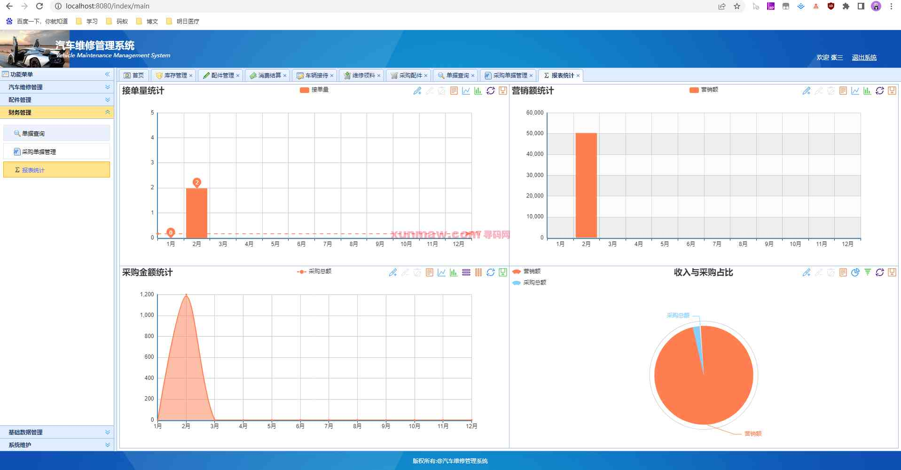
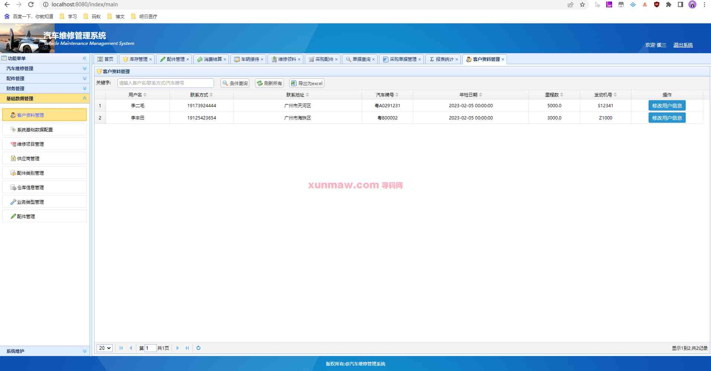
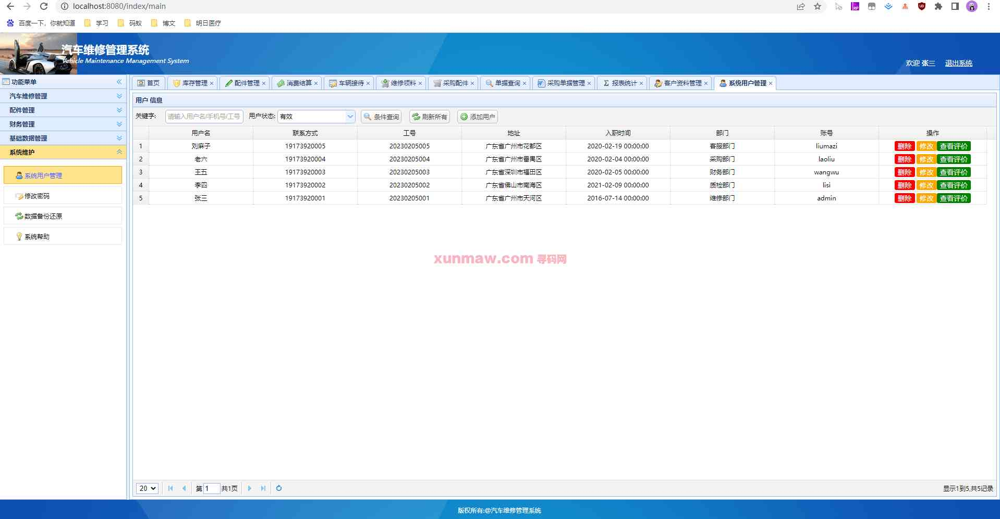

# 汽车维修管理系统

##  联系不到我，就看我的主页 
 
#### 介绍
本系统基于springboot + mybatis +jps架构开发，前后端分离，开发环境为jdk1.8、mysql、maven。系统功能主要分为汽车维修管理、配件管理、财务管理、基础数据管理、系统维护5大模块。

#### 软件架构
系统架构：springboot + mybatis +jps  
开发环境：jdk1.8、mysql、maven  

#### 功能结构

#### 功能介绍
##### 【代码结构与数据库截图】
 
  

##### 【功能详述】 
   首先通过登录页录入账号密码进行登录

   登录后首页为财务管理的报表页面，显示维修店经营情况。页面左侧可看到系统的各个模块的菜单入口。

△汽车维修管理
   本模块用于汽车维修整条业务的信息记录： 车辆接待、维修项目登记、维修领料、质检完工、消费结算。
   在车辆接待中登记车辆信息并选派维修人员与质检人员，登记维修项目后，根据项目领料，维修人员完成维修，质检人员完成质检，最后进行费用结算。

△配件管理
   用于管理汽车维修配件，分为采购配件与库存管理，可以在采购配件中查询采购记录，在库存管理中管理配件库存。

△财务管理
   展示业务经营情况，可以进行单据查询、采购单据管理及报表统计的查看。

△基础数据管理
   基础数据管理中可以对系统的各个模块信息设置进行维护，包括【客户资料管理】、【系统基础数据配置】、【维修项目管理】、【供应商管理】、【配件类别管理】、【仓库信息管理】、【业务类型管理】、【配件管理】。本模块可以让用户灵活自定义需要使用的表单。

△系统维护
   系统维护中【系统用户管理】可以用于管理本系统中登录的用户账号与访问的页面权限；【修改密码】即修改本账号密码；【数据还原备份】可用于备份或恢复备份信息；【系统帮助】可以查看系统使用说明，帮助用户快速上手。

   

#### 使用说明
1. 创建数据库，执行数据库脚本  
2. 修改jdbc数据库连接参数  
3. 下载安装maven依赖jar  
4. 启动springboot项目的即可  
请求地址： http://localhost:8080  
账号密码： admin|admin  
